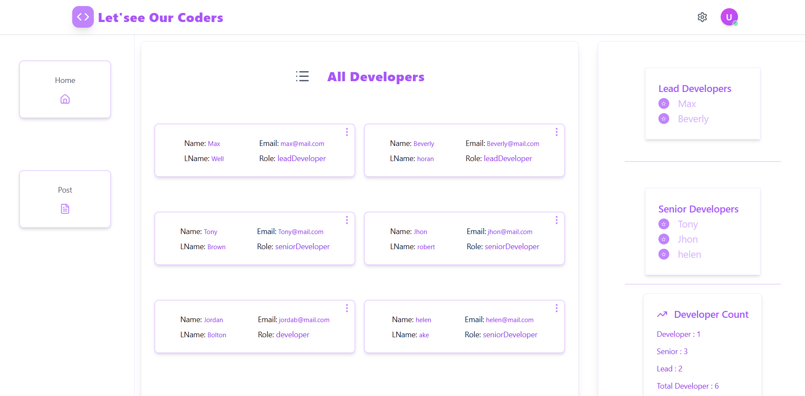

# DeveloperApp
DeveloperApp is a full-stack web application built with the MERN stack (MongoDB, Express, React, Node.js). It allows users to add, edit, and delete entries in a dynamic interface powered by modern UI tools.

# Techonolgy used

Frontend :- React, Tailwind CSS, Lucide React,Toastify
Backend:- Node.js, Express.js, nodemon, dotenv

DataBase:- MongoDB

# Features
 - CRUD operations (Create, Read, Update, Delete)
  - Responsive UI with Tailwind CSS
-  Toast notifications for user feedback
-  Lucide icons for clean, modern visual

# - Clone the repo
git clone  https://github.com/Hellobisrat/DeveloperApp

# Home page

# deployed url 

https://precious-lily-1fb884.netlify.app/